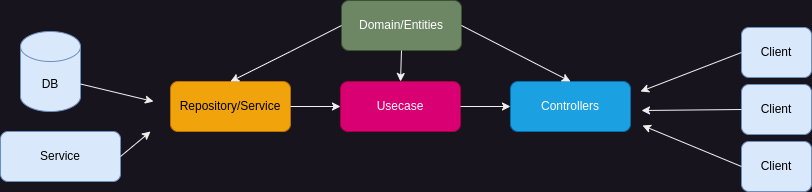

# Golang backend with clean architecture and JWT authentication

## Description

This is a ready to use Golang backend with clean architecture and JWT authentication.

## Prerequisite

- Golang : https://github.com/golang/go
- MySQL (Database) : https://github.com/mysql/mysql-server
- Air - Live reload : https://github.com/air-verse/air 

## Architecture



## Framework & Library

- GoFiber (HTTP Framework) v2 : https://github.com/gofiber/fiber
- Viper (Configuration) : https://github.com/spf13/viper
- Go Playground Validator (Validation) : https://github.com/go-playground/validator
- Zerolog : https://github.com/rs/zerolog
- JWT : https://github.com/golang-jwt/jwt

## Configuration

All configuration is in `./config/config.yaml` file. 

## Database

Available at `./.db/wetees.sql` file. 

## Available Features

- Health Check
- Login
- Register
- Change Password
- Order Item, Cancel Order, Checkout
- Deposit, Withdrawal 

## Postman Collection

Available at `./.postman/WeTeEs.postman_collection.json` file. 

## Run web server

```bash
go run ./cmd/main.go
```

or

```bash
air -c .air.toml
```

or

```bash
make watch-server
```

## References

- The Clean Architecture : https://blog.cleancoder.com/uncle-bob/2012/08/13/the-clean-architecture.html
- Fiber : https://gofiber.io/